# System Design Document
## Multi-Agent Research Platform — Complete Architecture

| Field | Value |
|---|---|
| Product | LitReviewer |
| Version | 1.0 — MVP |
| Author | Staff AI Engineer / Technical Architect |
| Date | 2026-06-08 |
| Status | Approved for Engineering |

---

## Table of Contents

1. [System Overview](#1-system-overview)
2. [Frontend Architecture](#2-frontend-architecture)
3. [Backend Architecture](#3-backend-architecture)
4. [Agent Architecture](#4-agent-architecture)
5. [RAG Pipeline](#5-rag-pipeline)
6. [Vector Database Design](#6-vector-database-design)
7. [Authentication Design](#7-authentication-design)
8. [Report Generation Pipeline](#8-report-generation-pipeline)
9. [Data Flow: End-to-End Request Lifecycle](#9-data-flow-end-to-end-request-lifecycle)
10. [Infrastructure & Deployment](#10-infrastructure--deployment)
11. [Error Handling Strategy](#11-error-handling-strategy)

---

## 1. System Overview

### 1.1 Top-Level Architecture

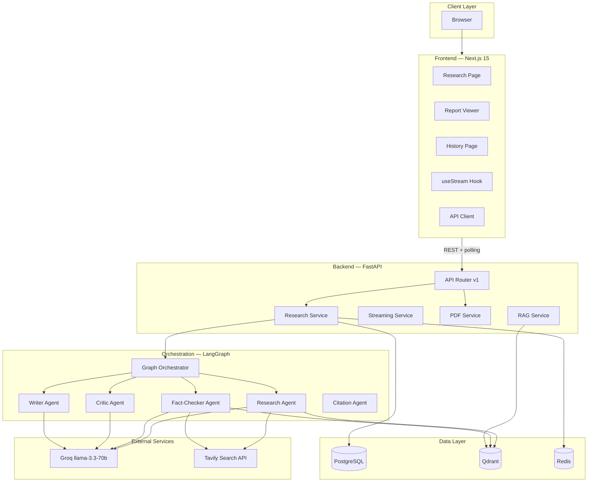
```mermaid
graph TB
    subgraph CLIENT["Client Layer"]
        B[Browser]
    end

    subgraph FRONTEND["Frontend — Next.js 15"]
        UI_RESEARCH[Research Page]
        UI_REPORT[Report Viewer]
        UI_HISTORY[History Page]
        SSE_HOOK[useStream Hook]
        API_CLIENT[API Client]
    end

    subgraph BACKEND["Backend — FastAPI"]
        ROUTER[API Router v1]
        RESEARCH_SVC[Research Service]
        STREAM_SVC[Streaming Service]
        PDF_SVC[PDF Service]
        RAG_SVC[RAG Service]
    end

    subgraph GRAPH["Orchestration — LangGraph"]
        ORCHESTRATOR[Graph Orchestrator]
        R_AGENT[Research Agent]
        FC_AGENT[Fact-Checker Agent]
        CR_AGENT[Critic Agent]
        W_AGENT[Writer Agent]
        CI_AGENT[Citation Agent]
    end

    subgraph DATA["Data Layer"]
        PG[(PostgreSQL)]
        QD[(Qdrant)]
        RD[(Redis)]
    end

    subgraph EXTERNAL["External Services"]
        GROQ[Groq llama-3.3-70b]
        TAVILY[Tavily Search API]
    end

    B --> FRONTEND
    FRONTEND -->|REST + polling| ROUTER
    ROUTER --> RESEARCH_SVC
    ROUTER --> PDF_SVC
    RESEARCH_SVC --> ORCHESTRATOR
    ORCHESTRATOR --> R_AGENT
    ORCHESTRATOR --> FC_AGENT
    ORCHESTRATOR --> CR_AGENT
    ORCHESTRATOR --> W_AGENT
    R_AGENT --> TAVILY
    FC_AGENT --> TAVILY
    R_AGENT & FC_AGENT --> QD
    R_AGENT & FC_AGENT & CR_AGENT & W_AGENT --> GROQ
    RESEARCH_SVC --> PG
    RESEARCH_SVC --> RD
    RAG_SVC --> QD
```

### 1.2 Key Design Principles

| Principle | Application |
|---|---|
| **Separation of concerns** | Each agent, service, and layer has a single, clearly bounded responsibility |
| **Explicit state** | LangGraph's typed state object is the single source of truth during a session |
| **Fail gracefully** | Every agent failure produces a partial result rather than a hard crash |
| **Observable by default** | Every agent execution is logged with input, output, and duration |
| **Config over code** | All tunable parameters (iteration limits, thresholds, model names) live in env vars |

---

## 2. Frontend Architecture

### 2.1 Application Structure

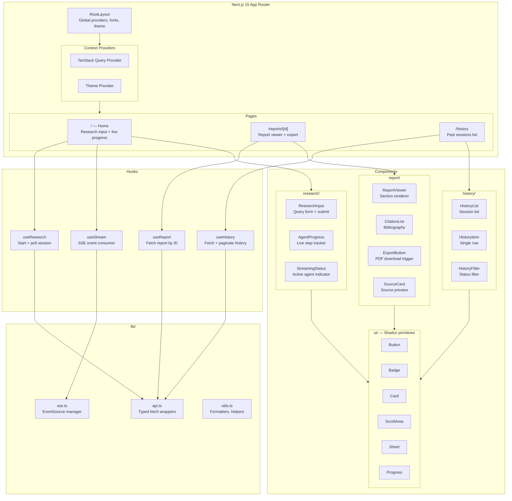
```mermaid
graph TD
    subgraph APP["Next.js 15 App Router"]
        ROOT_LAYOUT[RootLayout\nGlobal providers, fonts, theme]

        subgraph PAGES["Pages"]
            HOME["/ — Home\nResearch input + live progress"]
            REPORT["/reports/[id]\nReport viewer + export"]
            HISTORY["/history\nPast sessions list"]
        end

        subgraph PROVIDERS["Context Providers"]
            QUERY_PROVIDER[TanStack Query Provider]
            THEME_PROVIDER[Theme Provider]
        end
    end

    subgraph COMPONENTS["Components"]
        subgraph RESEARCH_COMP["research/"]
            RI[ResearchInput\nQuery form + submit]
            AP[AgentProgress\nLive step tracker]
            SS[StreamingStatus\nActive agent indicator]
        end

        subgraph REPORT_COMP["report/"]
            RV[ReportViewer\nSection renderer]
            CL[CitationList\nBibliography]
            EB[ExportButton\nPDF download trigger]
            SC[SourceCard\nSource preview]
        end

        subgraph HISTORY_COMP["history/"]
            HL[HistoryList\nSession list]
            HI[HistoryItem\nSingle row]
            HF[HistoryFilter\nStatus filter]
        end

        subgraph UI["ui/ — Shadcn primitives"]
            BUTTON[Button]
            BADGE[Badge]
            CARD[Card]
            SCROLL[ScrollArea]
            SHEET[Sheet]
            PROGRESS[Progress]
        end
    end

    subgraph HOOKS["Hooks"]
        USE_RESEARCH[useResearch\nStart + poll session]
        USE_STREAM[useStream\nSSE event consumer]
        USE_HISTORY[useHistory\nFetch + paginate history]
        USE_REPORT[useReport\nFetch report by ID]
    end

    subgraph LIB["lib/"]
        API_TS[api.ts\nTyped fetch wrappers]
        SSE_TS[sse.ts\nEventSource manager]
        UTILS[utils.ts\nFormatters, helpers]
    end

    ROOT_LAYOUT --> PROVIDERS
    PROVIDERS --> PAGES
    HOME --> RESEARCH_COMP
    REPORT --> REPORT_COMP
    HISTORY --> HISTORY_COMP
    RESEARCH_COMP & REPORT_COMP & HISTORY_COMP --> UI
    HOME --> USE_RESEARCH
    HOME --> USE_STREAM
    HISTORY --> USE_HISTORY
    REPORT --> USE_REPORT
    USE_RESEARCH & USE_HISTORY & USE_REPORT --> API_TS
    USE_STREAM --> SSE_TS
```

### 2.2 State Management Strategy

The frontend uses a **three-tier state model**:

| State Type | Tool | What Lives Here |
|---|---|---|
| **Server state** | TanStack Query | Report content, history list, session status — all fetched from the API and cached |
| **Stream state** | Custom `useStream` hook | Real-time agent events from SSE — ephemeral, never persisted |
| **UI state** | React `useState` / `useReducer` | Form values, modal open/close, active tab — local component concerns |

No global state manager (Redux, Zustand) is required in MVP. TanStack Query handles cache invalidation when a session completes.

### 2.3 SSE Client Flow

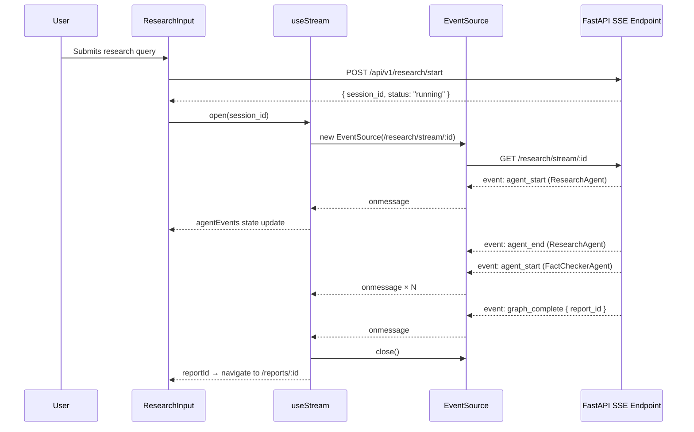
```mermaid
sequenceDiagram
    participant U as User
    participant UI as ResearchInput
    participant Hook as useStream
    participant SSE as EventSource
    participant BE as FastAPI SSE Endpoint

    U->>UI: Submits research query
    UI->>BE: POST /api/v1/research/start
    BE-->>UI: { session_id, status: "running" }
    UI->>Hook: open(session_id)
    Hook->>SSE: new EventSource(/research/stream/:id)
    SSE->>BE: GET /research/stream/:id
    BE-->>SSE: event: agent_start (ResearchAgent)
    SSE-->>Hook: onmessage
    Hook-->>UI: agentEvents state update
    BE-->>SSE: event: agent_end (ResearchAgent)
    BE-->>SSE: event: agent_start (FactCheckerAgent)
    SSE-->>Hook: onmessage × N
    BE-->>SSE: event: graph_complete { report_id }
    SSE-->>Hook: onmessage
    Hook->>SSE: close()
    Hook-->>UI: reportId → navigate to /reports/:id
```

### 2.4 Page Breakdown

**Home Page (`/`)**
- Left panel: `ResearchInput` with query textarea, optional settings drawer (max iterations, quality threshold)
- Right/below: `AgentProgress` — vertical timeline of agent steps; each step shows icon, name, plain-English description, elapsed time, and status (pending / active / complete / failed)
- Bottom: `StreamingStatus` — shows current active agent with animated indicator

**Report Page (`/reports/[id]`)**
- Header: report title, quality score badge, research date, word count
- Body: `ReportViewer` — renders sections with headings, body text with `[1]`-style superscript citation markers
- Right sidebar: `SourceCard` list — each source shows favicon, domain, title, and link
- Bottom: `CitationList` — numbered bibliography
- Sticky footer: `ExportButton` — "Download PDF"

**History Page (`/history`)**
- Filter bar: status pills (All / Complete / Running / Failed), sort (Newest / Oldest)
- `HistoryList`: paginated list of `HistoryItem` rows showing query preview, date, status badge, report link, delete action

### 2.5 Routing & Navigation

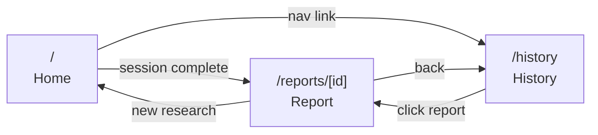
```mermaid
graph LR
    HOME["/\nHome"] -->|session complete| REPORT["/reports/[id]\nReport"]
    HOME -->|nav link| HISTORY["/history\nHistory"]
    HISTORY -->|click report| REPORT
    REPORT -->|back| HISTORY
    REPORT -->|new research| HOME
```

---

## 3. Backend Architecture

### 3.1 Layer Diagram

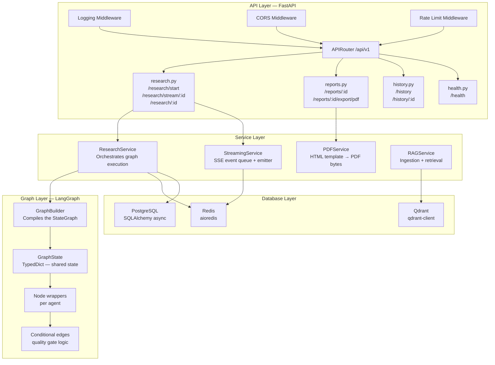
```mermaid
graph TD
    subgraph API["API Layer — FastAPI"]
        MW_LOG[Logging Middleware]
        MW_CORS[CORS Middleware]
        MW_RATE[Rate Limit Middleware]
        ROUTER_V1[APIRouter /api/v1]
        EP_RESEARCH[research.py\n/research/start\n/research/stream/:id\n/research/:id]
        EP_REPORTS[reports.py\n/reports/:id\n/reports/:id/export/pdf]
        EP_HISTORY[history.py\n/history\n/history/:id]
        EP_HEALTH[health.py\n/health]
    end

    subgraph SERVICE["Service Layer"]
        SVC_RESEARCH[ResearchService\nOrchestrates graph execution]
        SVC_STREAM[StreamingService\nSSE event queue + emitter]
        SVC_PDF[PDFService\nHTML template → PDF bytes]
        SVC_RAG[RAGService\nIngestion + retrieval]
    end

    subgraph GRAPH["Graph Layer — LangGraph"]
        GRAPH_BUILDER[GraphBuilder\nCompiles the StateGraph]
        GRAPH_STATE[GraphState\nTypedDict — shared state]
        GRAPH_NODES[Node wrappers\nper agent]
        GRAPH_EDGES[Conditional edges\nquality gate logic]
    end

    subgraph DB["Database Layer"]
        DB_PG[PostgreSQL\nSQLAlchemy async]
        DB_QD[Qdrant\nqdrant-client]
        DB_RD[Redis\naioredis]
    end

    ROUTER_V1 --> EP_RESEARCH & EP_REPORTS & EP_HISTORY & EP_HEALTH
    MW_LOG & MW_CORS & MW_RATE --> ROUTER_V1
    EP_RESEARCH --> SVC_RESEARCH & SVC_STREAM
    EP_REPORTS --> SVC_PDF
    SVC_RESEARCH --> GRAPH_BUILDER
    GRAPH_BUILDER --> GRAPH_STATE
    GRAPH_STATE --> GRAPH_NODES
    GRAPH_NODES --> GRAPH_EDGES
    SVC_RESEARCH & SVC_STREAM --> DB_RD
    SVC_RESEARCH --> DB_PG
    SVC_RAG --> DB_QD
```

### 3.2 Request Lifecycle (Research Start)

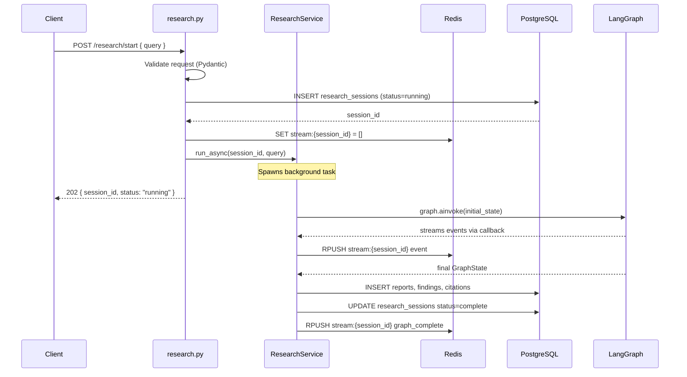
```mermaid
sequenceDiagram
    participant C as Client
    participant EP as research.py
    participant SVC as ResearchService
    participant RD as Redis
    participant PG as PostgreSQL
    participant GRAPH as LangGraph

    C->>EP: POST /research/start { query }
    EP->>EP: Validate request (Pydantic)
    EP->>PG: INSERT research_sessions (status=running)
    PG-->>EP: session_id
    EP->>RD: SET stream:{session_id} = []
    EP->>SVC: run_async(session_id, query)
    Note over SVC: Spawns background task
    EP-->>C: 202 { session_id, status: "running" }
    SVC->>GRAPH: graph.ainvoke(initial_state)
    GRAPH-->>SVC: streams events via callback
    SVC->>RD: RPUSH stream:{session_id} event
    GRAPH-->>SVC: final GraphState
    SVC->>PG: INSERT reports, findings, citations
    SVC->>PG: UPDATE research_sessions status=complete
    SVC->>RD: RPUSH stream:{session_id} graph_complete
```

### 3.3 Service Responsibilities

#### ResearchService
- Creates the session record in PostgreSQL
- Compiles and invokes the LangGraph `StateGraph`
- Subscribes to node-level callbacks to push SSE events to Redis
- Persists the final `GraphState` (report, findings, citations) to PostgreSQL
- Updates session status to `complete` or `failed`

#### StreamingService
- Holds a Redis pub/sub channel keyed to `session_id`
- The SSE endpoint consumes events from this channel via `async for`
- Formats each raw event into a properly structured SSE envelope
- Closes the stream on `graph_complete` or `error` event

#### RAGService
- Accepts a list of `(text, source_url)` tuples from the ResearchAgent
- Calls the `Embedder` to produce vectors
- Upserts points into Qdrant under the current `session_id`
- Exposes a `retrieve(query, session_id, k)` method for agent use

#### PDFService
- Accepts a `report_id`
- Fetches the report from PostgreSQL
- Renders an HTML template (Jinja2) with sections, citations, and bibliography
- Converts HTML to PDF bytes using WeasyPrint
- Returns bytes to the API endpoint for streaming download

### 3.4 Middleware Stack

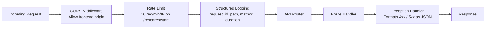
```mermaid
graph LR
    REQ[Incoming Request] --> CORS[CORS Middleware\nAllow frontend origin]
    CORS --> RATE[Rate Limit\n10 req/min/IP on /research/start]
    RATE --> LOG[Structured Logging\nrequest_id, path, method, duration]
    LOG --> ROUTER[API Router]
    ROUTER --> HANDLER[Route Handler]
    HANDLER --> ERR[Exception Handler\nFormats 4xx / 5xx as JSON]
    ERR --> RES[Response]
```

### 3.5 Configuration Management

All settings are loaded once at startup from environment variables via `pydantic-settings`. No settings are read at request time. Categories:

| Category | Variables |
|---|---|
| LLM | `GROQ_API_KEY`, `GROQ_MODEL`, `ANTHROPIC_API_KEY` (alternative) |
| Search | `TAVILY_API_KEY`, `TAVILY_MAX_RESULTS` |
| Databases | `POSTGRES_URL`, `QDRANT_URL`, `REDIS_URL` |
| Research tuning | `MAX_ITERATIONS`, `MIN_QUALITY_SCORE`, `RAG_TOP_K` |
| App | `ENVIRONMENT`, `LOG_LEVEL`, `API_RATE_LIMIT` |

---

## 4. Agent Architecture

### 4.1 Agent Class Hierarchy

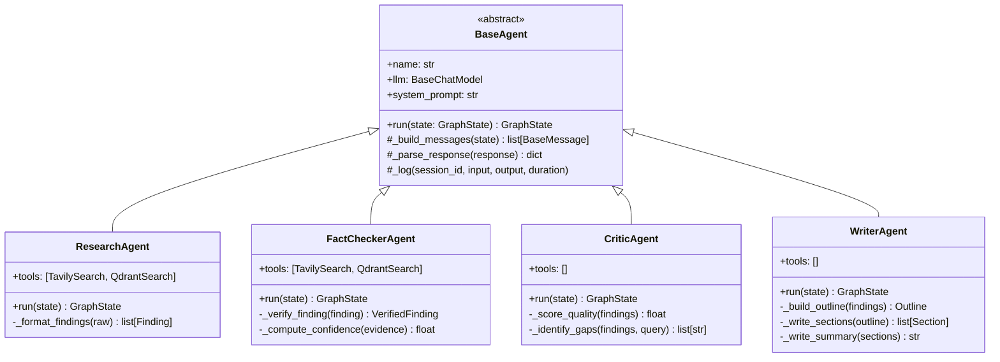
```mermaid
classDiagram
    class BaseAgent {
        <<abstract>>
        +name: str
        +llm: BaseChatModel
        +system_prompt: str
        +run(state: GraphState) GraphState
        #_build_messages(state) list[BaseMessage]
        #_parse_response(response) dict
        #_log(session_id, input, output, duration)
    }

    class ResearchAgent {
        +tools: [TavilySearch, QdrantSearch]
        +run(state) GraphState
        -_format_findings(raw) list[Finding]
    }

    class FactCheckerAgent {
        +tools: [TavilySearch, QdrantSearch]
        +run(state) GraphState
        -_verify_finding(finding) VerifiedFinding
        -_compute_confidence(evidence) float
    }

    class CriticAgent {
        +tools: []
        +run(state) GraphState
        -_score_quality(findings) float
        -_identify_gaps(findings, query) list[str]
    }

    class WriterAgent {
        +tools: []
        +run(state) GraphState
        -_build_outline(findings) Outline
        -_write_sections(outline) list[Section]
        -_write_summary(sections) str
    }

    BaseAgent <|-- ResearchAgent
    BaseAgent <|-- FactCheckerAgent
    BaseAgent <|-- CriticAgent
    BaseAgent <|-- WriterAgent
```

### 4.2 LangGraph State Machine

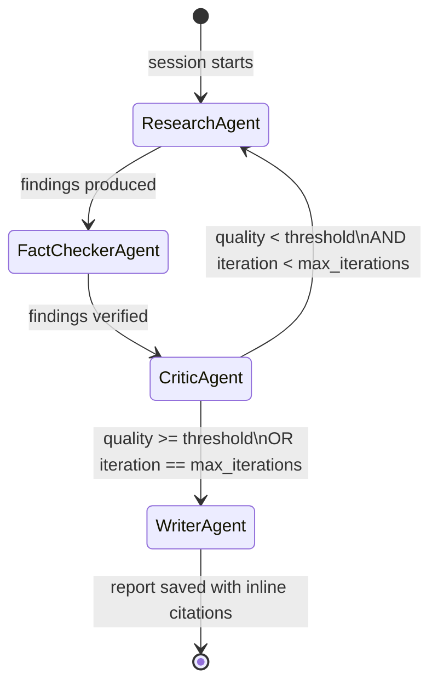
```mermaid
stateDiagram-v2
    [*] --> ResearchAgent : session starts

    ResearchAgent --> FactCheckerAgent : findings produced

    FactCheckerAgent --> CriticAgent : findings verified

    CriticAgent --> WriterAgent : quality >= threshold\nOR iteration == max_iterations

    CriticAgent --> ResearchAgent : quality < threshold\nAND iteration < max_iterations

    WriterAgent --> [*] : report saved with inline citations
```

### 4.3 GraphState Schema

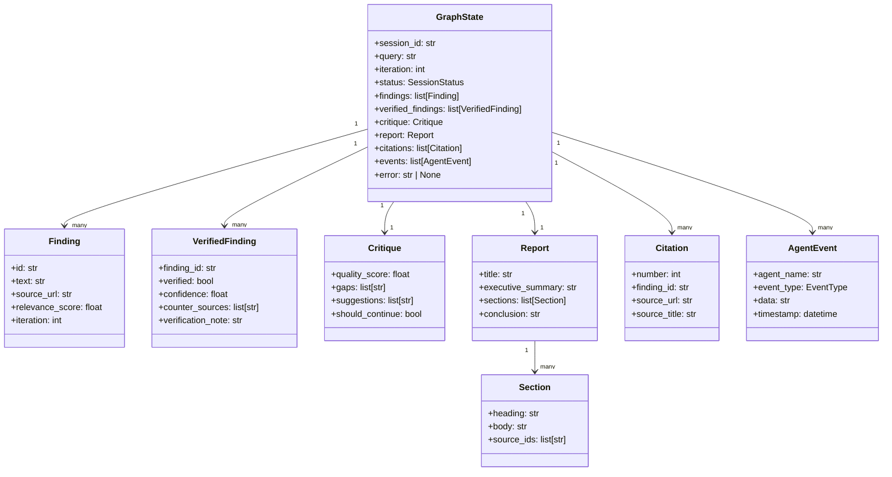
```mermaid
classDiagram
    class GraphState {
        +session_id: str
        +query: str
        +iteration: int
        +status: SessionStatus
        +findings: list[Finding]
        +verified_findings: list[VerifiedFinding]
        +critique: Critique
        +report: Report
        +citations: list[Citation]
        +events: list[AgentEvent]
        +error: str | None
    }

    class Finding {
        +id: str
        +text: str
        +source_url: str
        +relevance_score: float
        +iteration: int
    }

    class VerifiedFinding {
        +finding_id: str
        +verified: bool
        +confidence: float
        +counter_sources: list[str]
        +verification_note: str
    }

    class Critique {
        +quality_score: float
        +gaps: list[str]
        +suggestions: list[str]
        +should_continue: bool
    }

    class Report {
        +title: str
        +executive_summary: str
        +sections: list[Section]
        +conclusion: str
    }

    class Section {
        +heading: str
        +body: str
        +source_ids: list[str]
    }

    class Citation {
        +number: int
        +finding_id: str
        +source_url: str
        +source_title: str
    }

    class AgentEvent {
        +agent_name: str
        +event_type: EventType
        +data: str
        +timestamp: datetime
    }

    GraphState "1" --> "many" Finding
    GraphState "1" --> "many" VerifiedFinding
    GraphState "1" --> "1" Critique
    GraphState "1" --> "1" Report
    GraphState "1" --> "many" Citation
    GraphState "1" --> "many" AgentEvent
    Report "1" --> "many" Section
```

### 4.4 Agent Prompting Strategy

Each agent receives a **two-part prompt**:

1. **System Prompt** — Role definition, output format contract, and behavioral constraints. Fixed per agent.
2. **Human Prompt** — Dynamically assembled from `GraphState` at runtime: the query, current iteration context, and relevant prior outputs.

Agents are instructed to return **structured JSON** conforming to their output schema. The base class validates the response against the Pydantic model before writing it to `GraphState`.

| Agent | Output Format | Key Constraint |
|---|---|---|
| ResearchAgent | `FindingList` | 13–20 findings; each must have a real source URL |
| FactCheckerAgent | `list[VerifiedFinding]` | Must process every finding; `confidence` must be 0.0–1.0 |
| CriticAgent | `Critique` | `quality_score` must be 0.0–1.0; `gaps` must be specific, not generic |
| WriterAgent | `Report` with inline citations | Outline → section-by-section writing; includes inline `[N]` markers and bibliography |

### 4.5 Tool Assignment per Agent

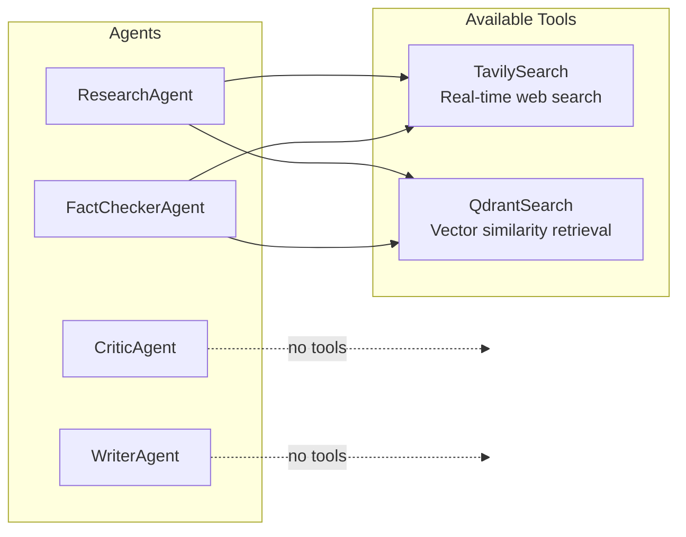
```mermaid
graph LR
    subgraph TOOLS["Available Tools"]
        T1[TavilySearch\nReal-time web search]
        T2[QdrantSearch\nVector similarity retrieval]
    end

    subgraph AGENTS["Agents"]
        A1[ResearchAgent]
        A2[FactCheckerAgent]
        A3[CriticAgent]
        A4[WriterAgent]
    end

    A1 --> T1
    A1 --> T2
    A2 --> T1
    A2 --> T2
    A3 -.->|no tools| X1[ ]
    A4 -.->|no tools| X2[ ]

    style X1 fill:none,stroke:none
    style X2 fill:none,stroke:none
```

**Rationale:** CriticAgent, WriterAgent, and CitationAgent perform pure reasoning over data already in `GraphState`. Giving them tool access would risk introducing new unverified information at the synthesis stage, which violates the trust contract.

### 4.6 Quality Gate Edge Logic

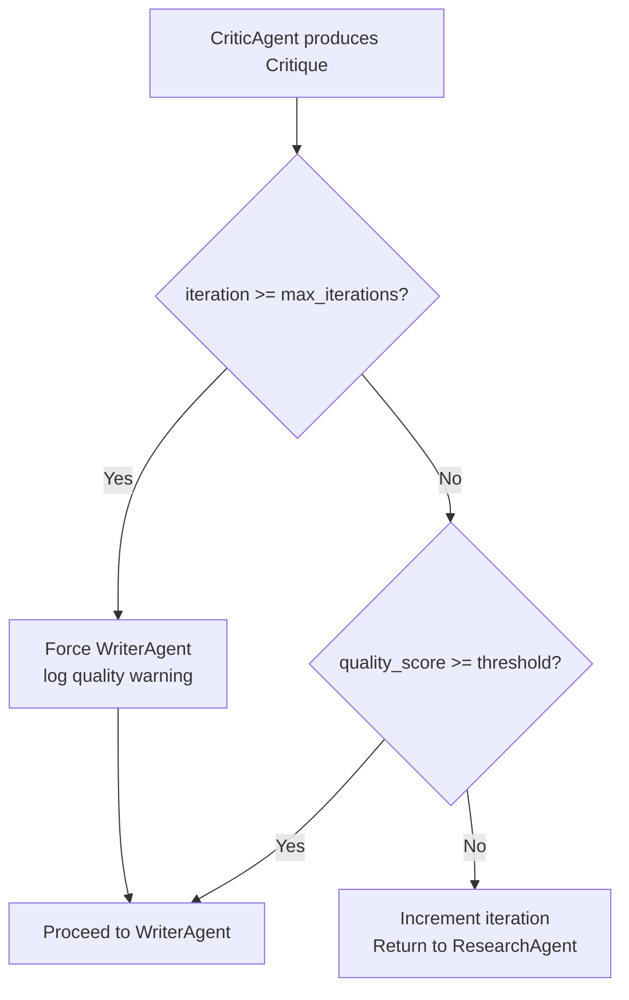
```mermaid
flowchart TD
    CR[CriticAgent produces Critique]
    CHECK_ITER{iteration >= max_iterations?}
    CHECK_QUAL{quality_score >= threshold?}
    FORCE_WRITE[Force WriterAgent\nlog quality warning]
    LOOP[Increment iteration\nReturn to ResearchAgent]
    WRITE[Proceed to WriterAgent]

    CR --> CHECK_ITER
    CHECK_ITER -->|Yes| FORCE_WRITE
    CHECK_ITER -->|No| CHECK_QUAL
    CHECK_QUAL -->|Yes| WRITE
    CHECK_QUAL -->|No| LOOP
    FORCE_WRITE --> WRITE
```

---

## 5. RAG Pipeline

### 5.1 Full RAG Flow

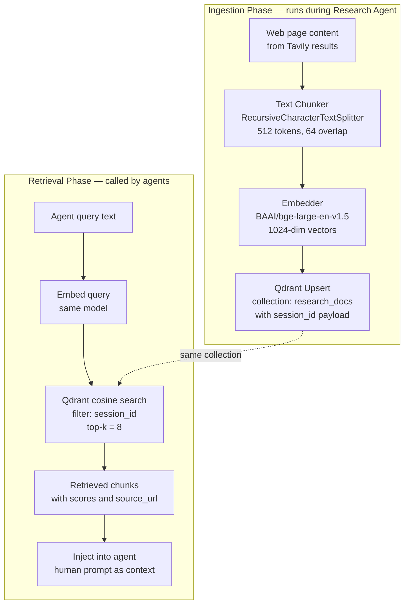
```mermaid
flowchart TD
    subgraph INGEST["Ingestion Phase — runs during Research Agent"]
        WEB[Web page content\nfrom Tavily results]
        CHUNK[Text Chunker\nRecursiveCharacterTextSplitter\n512 tokens, 64 overlap]
        EMBED[Embedder\nBAAI/bge-large-en-v1.5\n1024-dim vectors]
        STORE[Qdrant Upsert\ncollection: research_docs\nwith session_id payload]
        WEB --> CHUNK --> EMBED --> STORE
    end

    subgraph RETRIEVE["Retrieval Phase — called by agents"]
        QUERY[Agent query text]
        QEMBED[Embed query\nsame model]
        SEARCH[Qdrant cosine search\nfilter: session_id\ntop-k = 8]
        RESULTS[Retrieved chunks\nwith scores and source_url]
        CONTEXT[Inject into agent\nhuman prompt as context]
        QUERY --> QEMBED --> SEARCH --> RESULTS --> CONTEXT
    end

    STORE -.->|same collection| SEARCH
```

### 5.2 Ingestion Pipeline Detail

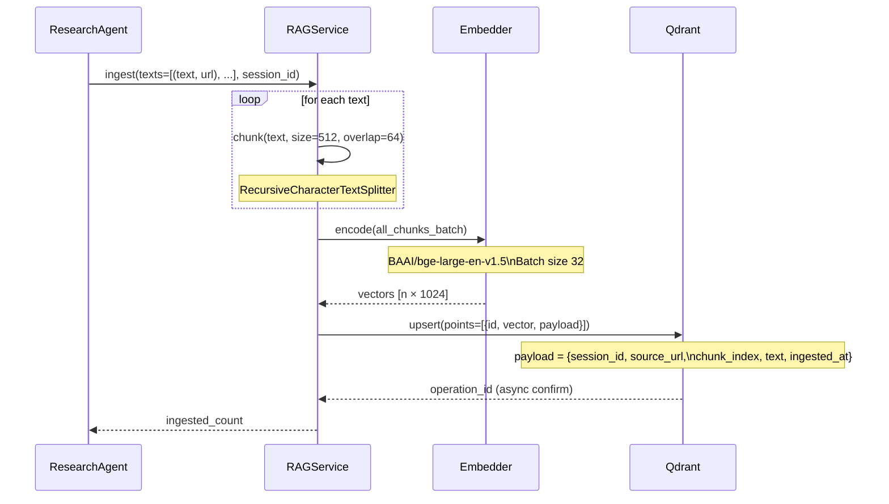
```mermaid
sequenceDiagram
    participant RA as ResearchAgent
    participant RAG as RAGService
    participant EMB as Embedder
    participant QD as Qdrant

    RA->>RAG: ingest(texts=[(text, url), ...], session_id)
    loop for each text
        RAG->>RAG: chunk(text, size=512, overlap=64)
        Note over RAG: RecursiveCharacterTextSplitter
    end
    RAG->>EMB: encode(all_chunks_batch)
    Note over EMB: BAAI/bge-large-en-v1.5\nBatch size 32
    EMB-->>RAG: vectors [n × 1024]
    RAG->>QD: upsert(points=[{id, vector, payload}])
    Note over QD: payload = {session_id, source_url,\nchunk_index, text, ingested_at}
    QD-->>RAG: operation_id (async confirm)
    RAG-->>RA: ingested_count
```

### 5.3 Retrieval Pipeline Detail

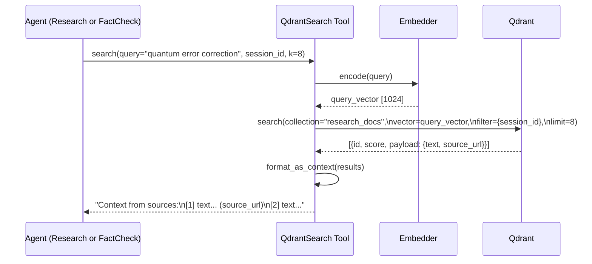
```mermaid
sequenceDiagram
    participant AGT as Agent (Research or FactCheck)
    participant TOOL as QdrantSearch Tool
    participant EMB as Embedder
    participant QD as Qdrant

    AGT->>TOOL: search(query="quantum error correction", session_id, k=8)
    TOOL->>EMB: encode(query)
    EMB-->>TOOL: query_vector [1024]
    TOOL->>QD: search(collection="research_docs",\nvector=query_vector,\nfilter={session_id},\nlimit=8)
    QD-->>TOOL: [{id, score, payload: {text, source_url}}]
    TOOL->>TOOL: format_as_context(results)
    TOOL-->>AGT: "Context from sources:\n[1] text... (source_url)\n[2] text..."
```

### 5.4 Chunking Strategy

| Parameter | Value | Rationale |
|---|---|---|
| Chunk size | 512 tokens | Fits well within LLM context; large enough for coherent facts |
| Overlap | 64 tokens | Prevents splitting mid-sentence for claims spanning chunk boundaries |
| Splitter | `RecursiveCharacterTextSplitter` | Respects paragraph → sentence → word hierarchy; better semantic boundaries than fixed-size |
| Min chunk size | 100 tokens | Discard noise fragments (headers, footers, nav text) |

### 5.5 Embedding Model Details

| Property | Value |
|---|---|
| Model | BAAI/bge-large-en-v1.5 |
| Dimensions | 1024 |
| Max input tokens | 512 |
| Distance metric | Cosine similarity |
| Inference | CPU (MVP); batch size 32 |
| Instruction prefix | `"Represent this sentence for searching relevant passages: "` (for queries) |
| Normalization | L2-normalized embeddings (required for cosine via dot product) |

---

## 6. Vector Database Design

### 6.1 Qdrant Collection Schema

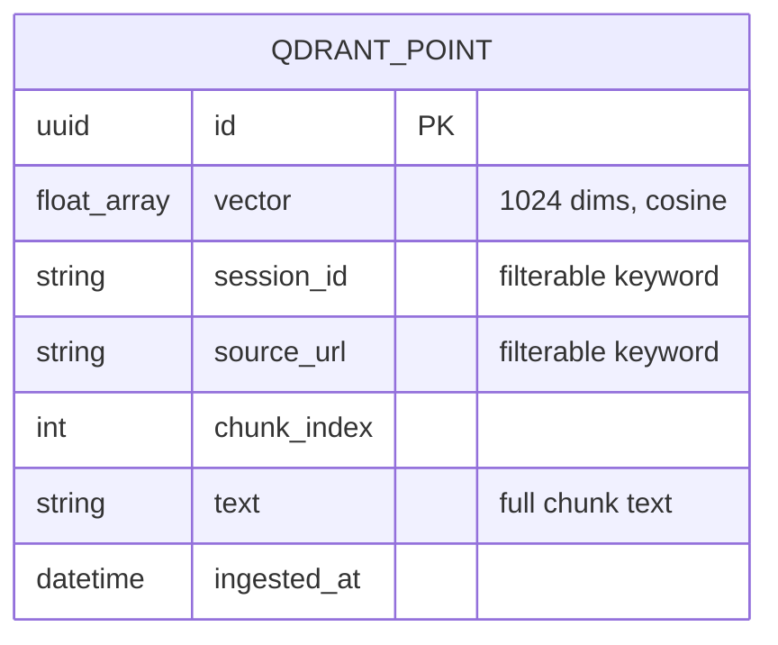
```mermaid
erDiagram
    QDRANT_POINT {
        uuid id PK
        float_array vector "1024 dims, cosine"
        string session_id "filterable keyword"
        string source_url "filterable keyword"
        int chunk_index
        string text "full chunk text"
        datetime ingested_at
    }
```

### 6.2 Collection Configuration

| Setting | Value | Reason |
|---|---|---|
| Collection name | `research_docs` | Single collection; scoped by `session_id` filter |
| Vector size | 1024 | Matches bge-large-en-v1.5 output dimensions |
| Distance | Cosine | Standard for semantic similarity; works with normalized vectors |
| Index type | HNSW | Production-grade ANN index; handles millions of vectors |
| HNSW `m` | 16 | Controls graph connectivity; 16 is Qdrant default, good for 1M vectors |
| HNSW `ef_construct` | 100 | Index build quality; higher = better recall at build cost |
| `on_disk_payload` | false (MVP) | Keep payloads in memory for fast retrieval; switch to `true` for large deployments |
| Quantization | None (MVP) | Full float32 precision; add scalar quantization post-MVP if memory is a concern |

### 6.3 Payload Indexes

Qdrant supports payload-level indexes for filtering. The following fields are indexed for efficient filtering:

| Field | Index Type | Used By |
|---|---|---|
| `session_id` | Keyword | All retrievals — scopes search to current session |
| `source_url` | Keyword | Deduplication check before ingesting a URL twice |
| `ingested_at` | Datetime | Future: time-range filtering for incremental re-research |

### 6.4 Data Lifecycle

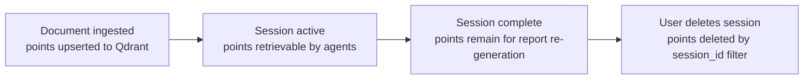
```mermaid
flowchart LR
    INGEST[Document ingested\npoints upserted to Qdrant]
    ACTIVE[Session active\npoints retrievable by agents]
    COMPLETE[Session complete\npoints remain for report re-generation]
    DELETE[User deletes session\npoints deleted by session_id filter]

    INGEST --> ACTIVE --> COMPLETE --> DELETE
```

**Retention policy (MVP):** Qdrant points are kept indefinitely until the user deletes the session. On deletion, a `delete_by_filter(session_id=X)` removes all associated vectors. No background expiry in MVP.

### 6.5 Query Patterns

| Query | Filter | Top-k | Called By |
|---|---|---|---|
| Semantic retrieval during research | `session_id == current` | 8 | ResearchAgent |
| Semantic retrieval during fact-check | `session_id == current` | 5 | FactCheckerAgent |
| Deduplication check | `source_url == url AND session_id == current` | 1 | RAGService (before ingest) |
| Session cleanup | `session_id == target` | N/A — delete filter | History DELETE endpoint |

---

## 7. Authentication Design

> **MVP Note:** Authentication is not implemented in MVP. The platform operates as a single-user local deployment. This section defines the target auth architecture for v2.0 and is included to ensure the current design does not create obstacles for its future addition.

### 7.1 Target Auth Architecture (v2.0)

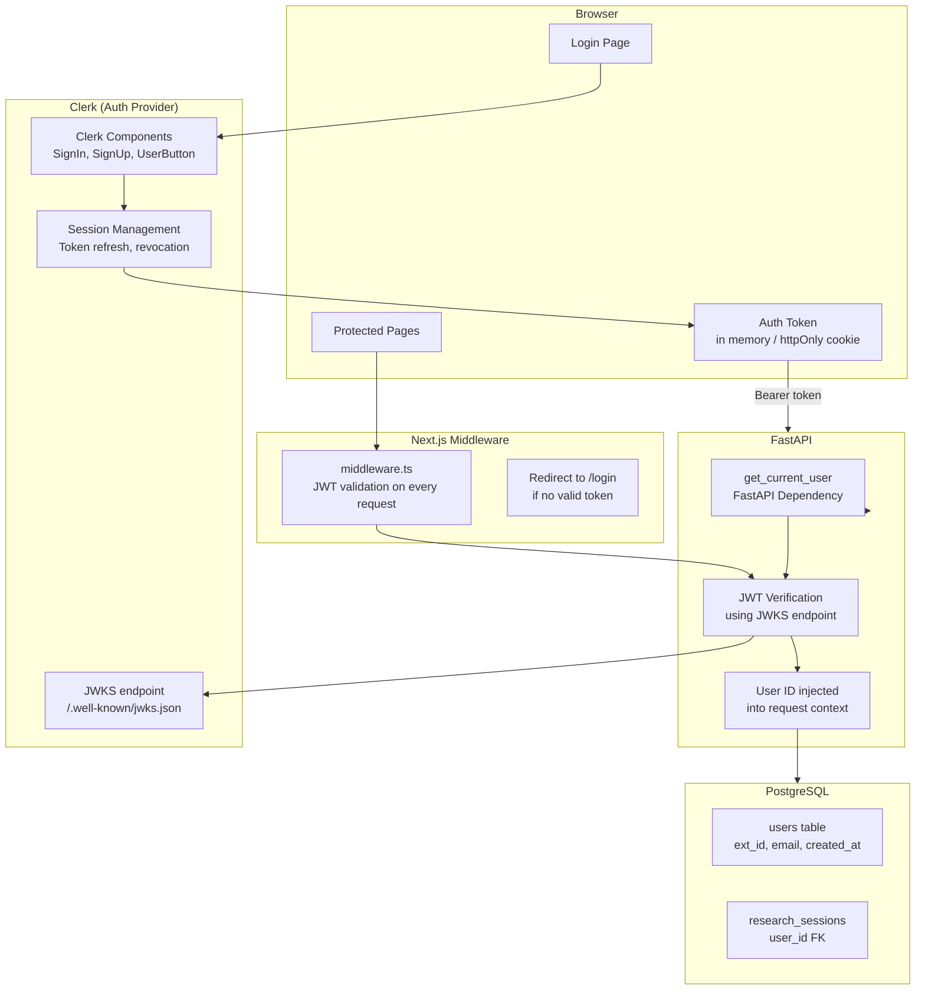
```mermaid
graph TD
    subgraph CLIENT["Browser"]
        LOGIN[Login Page]
        PROTECTED[Protected Pages]
        AUTH_STORE[Auth Token\nin memory / httpOnly cookie]
    end

    subgraph NEXTJS["Next.js Middleware"]
        MW[middleware.ts\nJWT validation on every request]
        REDIRECT[Redirect to /login\nif no valid token]
    end

    subgraph FASTAPI["FastAPI"]
        AUTH_DEP[get_current_user\nFastAPI Dependency]
        JWT_VERIFY[JWT Verification\nusing JWKS endpoint]
        USER_CTX[User ID injected\ninto request context]
    end

    subgraph CLERK["Clerk (Auth Provider)"]
        CLERK_UI[Clerk Components\nSignIn, SignUp, UserButton]
        CLERK_JWT[JWKS endpoint\n/.well-known/jwks.json]
        CLERK_SESSION[Session Management\nToken refresh, revocation]
    end

    subgraph DB["PostgreSQL"]
        USERS[users table\next_id, email, created_at]
        SESSIONS[research_sessions\nuser_id FK]
    end

    LOGIN --> CLERK_UI
    CLERK_UI --> CLERK_SESSION
    CLERK_SESSION --> AUTH_STORE
    PROTECTED --> MW
    MW --> JWT_VERIFY
    JWT_VERIFY --> CLERK_JWT
    AUTH_STORE -->|Bearer token| FASTAPI
    FASTAPI --> AUTH_DEP
    AUTH_DEP --> JWT_VERIFY
    JWT_VERIFY --> USER_CTX
    USER_CTX --> DB
```

### 7.2 Auth Provider: Clerk

**Why Clerk over NextAuth or Auth.js:**
- Native Next.js App Router support with pre-built `<SignIn />` components
- Provides both client SDK and a backend JWT verification library
- JWKS endpoint for stateless JWT validation in FastAPI — no database round-trip per request
- Handles refresh tokens, session revocation, and MFA out of the box

### 7.3 Data Isolation Model

When auth is added, every database query will be scoped by `user_id`:

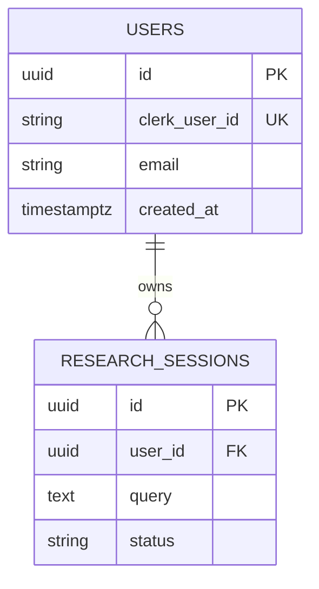
```mermaid
erDiagram
    USERS {
        uuid id PK
        string clerk_user_id UK
        string email
        timestamptz created_at
    }

    RESEARCH_SESSIONS {
        uuid id PK
        uuid user_id FK
        text query
        string status
    }

    USERS ||--o{ RESEARCH_SESSIONS : "owns"
```

All API endpoints will receive `user_id` via a `get_current_user` FastAPI dependency. Session queries will include `WHERE user_id = :user_id`, ensuring users can only access their own data.

### 7.4 Migration Path from MVP to Authenticated

To add auth post-MVP without breaking existing data:

1. Add `users` table via Alembic migration
2. Add `user_id UUID NULLABLE FK` to `research_sessions` (nullable for existing rows)
3. Deploy Clerk integration to Next.js frontend
4. Add `get_current_user` dependency to FastAPI endpoints
5. Backfill `user_id` on existing sessions to a single "admin" user
6. Make `user_id` NOT NULL once backfill is confirmed
7. Add `user_id` WHERE clause to all repository queries

---

## 8. Report Generation Pipeline

### 8.1 Full Pipeline

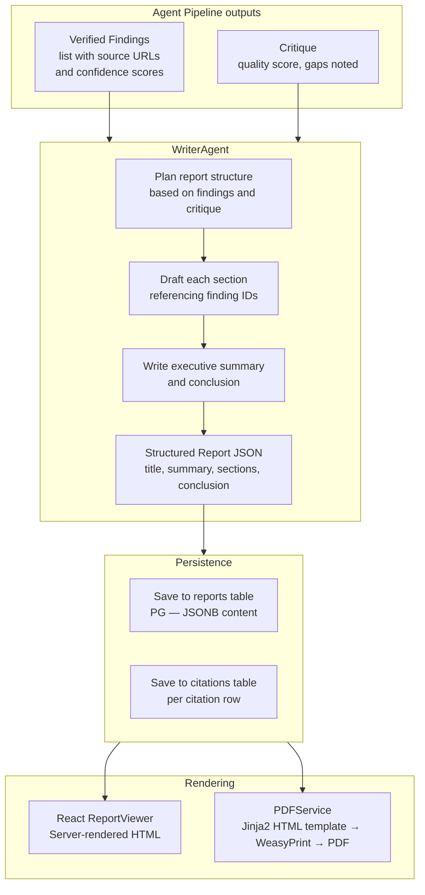
```mermaid
flowchart TD
    subgraph AGENTS["Agent Pipeline outputs"]
        VF[Verified Findings\nlist with source URLs\nand confidence scores]
        CR2[Critique\nquality score, gaps noted]
    end

    subgraph WRITER["WriterAgent"]
        W_PLAN[Plan report structure\nbased on findings and critique]
        W_SECTIONS[Draft each section\nreferencing finding IDs]
        W_SUMMARY[Write executive summary\nand conclusion]
        W_OUT[Structured Report JSON\ntitle, summary, sections, conclusion]
        W_PLAN --> W_SECTIONS --> W_SUMMARY --> W_OUT
    end

    subgraph PERSIST["Persistence"]
        PG_REPORT[Save to reports table\nPG — JSONB content]
        PG_CITE[Save to citations table\nper citation row]
    end

    subgraph RENDER["Rendering"]
        WEB_RENDER[React ReportViewer\nServer-rendered HTML]
        PDF_RENDER[PDFService\nJinja2 HTML template → WeasyPrint → PDF]
    end

    VF & CR2 --> WRITER
    W_OUT --> PERSIST
    PERSIST --> WEB_RENDER
    PERSIST --> PDF_RENDER
```

### 8.2 WriterAgent Report Structure

The WriterAgent produces a strict JSON schema. The structure maps directly to the database and UI rendering:

```mermaid
graph TD
    REPORT[Report]
    REPORT --> TITLE[title: str]
    REPORT --> SUMMARY[executive_summary: str\n150-250 words]
    REPORT --> SECTIONS[sections: list]
    REPORT --> CONCLUSION[conclusion: str\n100-150 words]

    SECTIONS --> S1[Section 1]
    SECTIONS --> S2[Section 2]
    SECTIONS --> S3[Section N]

    S1 --> H1[heading: str]
    S1 --> B1[body: str\n200-400 words]
    S1 --> SRC1[source_ids: list of finding IDs\nused in this section]
```

### 8.3 CitationAgent Matching Strategy

```mermaid
flowchart TD
    INPUT[Report body text\n+ Verified findings list]
    SENT[Split body into sentences]
    CLAIM{Is sentence a\nfactual claim?}
    MATCH[Find best matching\nfinding by semantic similarity\nbetween sentence and finding text]
    CONF{Similarity score\n>= 0.75?}
    INSERT[Insert [N] citation marker\nat end of sentence]
    SKIP[Leave sentence without\ncitation marker]
    NEXT[Next sentence]
    BIB[Build bibliography\nfrom all cited findings]

    INPUT --> SENT
    SENT --> CLAIM
    CLAIM -->|Yes| MATCH
    CLAIM -->|No| NEXT
    MATCH --> CONF
    CONF -->|Yes| INSERT
    CONF -->|No| SKIP
    INSERT --> NEXT
    SKIP --> NEXT
    NEXT --> CLAIM
    NEXT --> BIB
```

### 8.4 PDF Generation Pipeline

```mermaid
sequenceDiagram
    participant C as Client
    participant EP as reports.py
    participant PDF as PDFService
    participant DB as PostgreSQL
    participant J2 as Jinja2 Template
    participant WP as WeasyPrint

    C->>EP: GET /reports/:id/export/pdf
    EP->>DB: SELECT report + citations WHERE id=:id
    DB-->>EP: Report + Citation rows
    EP->>PDF: generate(report, citations)
    PDF->>J2: render("report_template.html", context)
    J2-->>PDF: HTML string
    PDF->>WP: HTML(string=html).write_pdf()
    Note over WP: Applies CSS: fonts, page breaks,\nheader/footer, citation styling
    WP-->>PDF: pdf_bytes
    PDF-->>EP: pdf_bytes
    EP-->>C: StreamingResponse\napplication/pdf\nContent-Disposition: attachment
```

### 8.5 PDF Template Structure

```mermaid
graph TD
    PDF_DOC[PDF Document]
    PDF_DOC --> COVER[Cover Block\nReport title\nQuery\nDate generated\nQuality score badge]
    PDF_DOC --> EXEC[Executive Summary\nShaded background box]
    PDF_DOC --> BODY[Report Sections\nHeading + body paragraphs\nInline [N] superscript markers]
    PDF_DOC --> CONCL[Conclusion]
    PDF_DOC --> BIB[Bibliography\nNumbered list\nURL as hyperlink]
    PDF_DOC --> FOOTER[Page Footer\nLitReviewer · Page N of M]
```

### 8.6 Report Data Model (Database)

```mermaid
erDiagram
    RESEARCH_SESSIONS {
        uuid id PK
        text query
        string status
        int iteration
        timestamptz created_at
        timestamptz completed_at
    }

    REPORTS {
        uuid id PK
        uuid session_id FK
        text title
        text executive_summary
        jsonb content
        float quality_score
        int word_count
        timestamptz created_at
    }

    FINDINGS {
        uuid id PK
        uuid session_id FK
        text text
        text source_url
        float relevance_score
        boolean verified
        float confidence
        int iteration
    }

    CITATIONS {
        uuid id PK
        uuid report_id FK
        uuid finding_id FK
        int citation_number
        text source_url
        text source_title
        timestamptz accessed_at
    }

    AGENT_LOGS {
        uuid id PK
        uuid session_id FK
        string agent_name
        jsonb input
        jsonb output
        int duration_ms
        timestamptz created_at
    }

    RESEARCH_SESSIONS ||--o| REPORTS : "produces"
    RESEARCH_SESSIONS ||--o{ FINDINGS : "contains"
    RESEARCH_SESSIONS ||--o{ AGENT_LOGS : "records"
    REPORTS ||--o{ CITATIONS : "references"
    FINDINGS ||--o{ CITATIONS : "cited as"
```

---

## 9. Data Flow: End-to-End Request Lifecycle

### 9.1 Complete Research Session Flow

```mermaid
sequenceDiagram
    actor U as User
    participant FE as Next.js Frontend
    participant API as FastAPI
    participant SVC as ResearchService
    participant GRAPH as LangGraph
    participant RA as ResearchAgent
    participant FC as FactCheckerAgent
    participant CR as CriticAgent
    participant WA as WriterAgent
    participant RAG as RAGService
    participant PG as PostgreSQL
    participant QD as Qdrant
    participant GROQ as Groq llama-3.3-70b
    participant TAV as Tavily API

    U->>FE: Enter query, click Research
    FE->>API: POST /research/start
    API->>PG: INSERT session (running)
    API-->>FE: 202 { session_id }
    FE->>API: GET /research/{session_id} (polling)

    Note over GRAPH: Background task starts

    GRAPH->>RA: invoke with initial state
    RA->>GROQ: generate search plan (structured output)
    GROQ-->>RA: ResearchPlan (sub-queries)
    RA->>TAV: search(sub-queries, max_results=20)
    TAV-->>RA: web results
    RA->>QD: RAG retrieve(queries, session_id)
    QD-->>RA: top-k chunks
    RA->>GROQ: synthesize findings
    GROQ-->>RA: FindingList JSON (13-20 findings)
    RA->>RAG: ingest(web content, session_id)
    RAG->>QD: embed + upsert chunks

    GRAPH->>FC: invoke with findings
    FC->>TAV: verify claims (independent queries)
    TAV-->>FC: verification results
    FC->>QD: retrieve related chunks
    QD-->>FC: top-k chunks
    FC->>GROQ: assess each claim
    GROQ-->>FC: verified findings JSON

    GRAPH->>CR: invoke with verified findings
    CR->>GROQ: evaluate quality
    GROQ-->>CR: critique + quality_score

    Note over GRAPH: quality >= threshold → proceed to write

    GRAPH->>WA: invoke with findings + critique
    WA->>GROQ: generate outline
    GROQ-->>WA: structured outline
    WA->>GROQ: write sections (sectional mode)
    GROQ-->>WA: cited report with inline citations

    SVC->>PG: INSERT report, findings, citations
    SVC->>PG: UPDATE session status=complete

    FE->>API: GET /research/{session_id} (poll detects complete)
    API->>PG: SELECT report + citations
    PG-->>API: report data
    API-->>FE: report JSON
    FE->>U: Render full report with citations
```

---

## 10. Infrastructure & Deployment

### 10.1 Docker Compose Service Graph

```mermaid
graph TD
    subgraph COMPOSE["docker-compose.yml"]
        FE_SVC[frontend\nNext.js 15\nport 3000]
        BE_SVC[backend\nFastAPI + Uvicorn\nport 8000]
        PG_SVC[postgres\nPostgreSQL 16\nport 5432]
        QD_SVC[qdrant\nQdrant latest\nport 6333 REST\nport 6334 gRPC]
        RD_SVC[redis\nRedis 7 Alpine\nport 6379]
    end

    FE_SVC -->|HTTP| BE_SVC
    BE_SVC -->|asyncpg| PG_SVC
    BE_SVC -->|REST| QD_SVC
    BE_SVC -->|aioredis| RD_SVC
```

### 10.2 Service Configuration

| Service | Image | Persistence | Health Check |
|---|---|---|---|
| `postgres` | `postgres:16-alpine` | Named volume `pg_data` | `pg_isready -U postgres` |
| `qdrant` | `qdrant/qdrant:latest` | Named volume `qdrant_data` | HTTP GET `/healthz` |
| `redis` | `redis:7-alpine` | No persistence (MVP) | `redis-cli ping` |
| `backend` | Custom Dockerfile | None (stateless) | HTTP GET `/health` |
| `frontend` | Custom Dockerfile | None (stateless) | HTTP GET `/` |

### 10.3 Environment Variable Injection

```mermaid
graph LR
    ENV[.env file\nproject root]
    COMPOSE[docker-compose.yml\nenv_file directive]
    BE[backend container\npydantic-settings reads]
    FE[frontend container\nNEXT_PUBLIC_* variables]

    ENV --> COMPOSE
    COMPOSE --> BE
    COMPOSE --> FE
```

---

## 11. Error Handling Strategy

### 11.1 Error Classification

| Layer | Error Type | Handling Strategy |
|---|---|---|
| API | Validation error (422) | Pydantic catches; returns structured JSON with field-level errors |
| API | Rate limit exceeded (429) | Middleware returns `Retry-After` header |
| API | Internal error (500) | Exception handler logs full traceback; returns sanitized message |
| Agent | LLM response invalid JSON | Retry with stricter prompt up to 2 times; use partial result on 3rd failure |
| Agent | LLM API timeout / 5xx | Exponential backoff: 1s, 2s, 4s; fail agent after 3 attempts |
| Agent | Tool (Tavily) failure | Log warning; agent proceeds with empty tool result + note in findings |
| Graph | Agent raises exception | Catch in node wrapper; set `state.error`; skip to WriterAgent with partial data |
| Graph | Max iterations reached | Force transition to WriterAgent; include quality warning in report metadata |
| RAG | Qdrant upsert failure | Log error; agents fall back to web-only mode (no RAG context) |
| PDF | WeasyPrint failure | Return 500 with retry suggestion; report still viewable in-browser |

### 11.2 Graceful Degradation Flow

```mermaid
flowchart TD
    START[Session starts]
    RA_OK{ResearchAgent\nsucceeds?}
    FC_OK{FactCheckerAgent\nsucceeds?}
    WA_OK{WriterAgent\nsucceeds?}

    RA_FAIL[Use empty findings list\nmark sources as unavailable]
    FC_FAIL[Pass unverified findings\nmark all confidence = null]
    WA_FAIL[Return raw findings JSON\nwithout narrative report]

    REPORT_FULL[Full cited report\nquality_score present]
    REPORT_PARTIAL[Partial report\nfact_check_skipped: true]
    REPORT_MINIMAL[Raw findings only\nno narrative]
    REPORT_EMPTY[Session failed\nerror message shown]

    START --> RA_OK
    RA_OK -->|Yes| FC_OK
    RA_OK -->|No| RA_FAIL --> REPORT_EMPTY
    FC_OK -->|Yes| WA_OK
    FC_OK -->|No| FC_FAIL --> WA_OK
    WA_OK -->|Yes| REPORT_FULL
    WA_OK -->|No| WA_FAIL
    FC_FAIL --> WA_FAIL --> REPORT_MINIMAL
```

---

*Document ends. For API endpoint contracts, refer to `docs/api-spec.md`. For database migrations, refer to `backend/migrations/`.*
